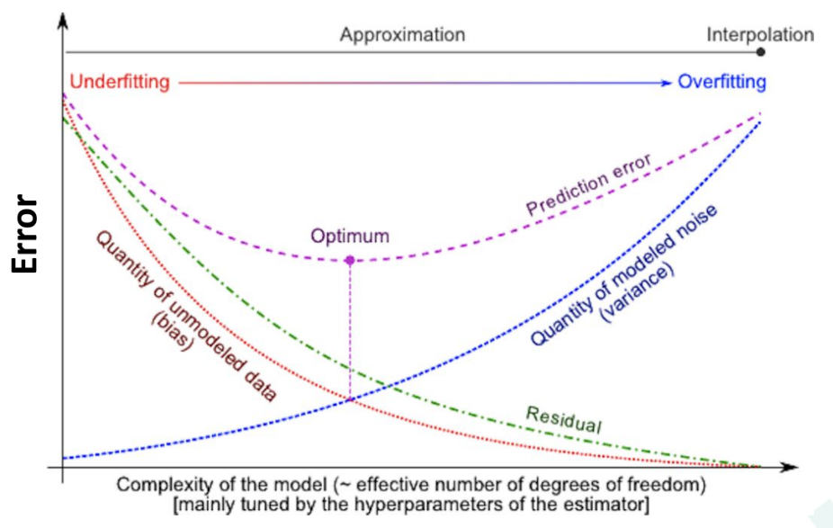
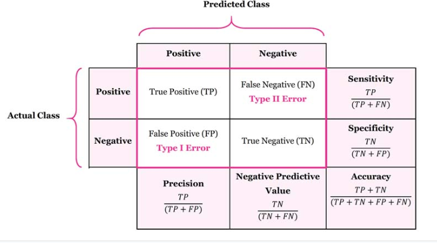
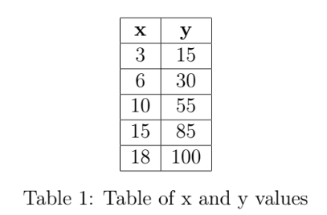
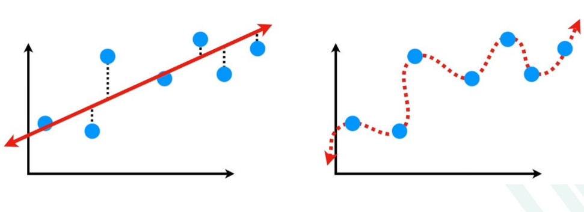
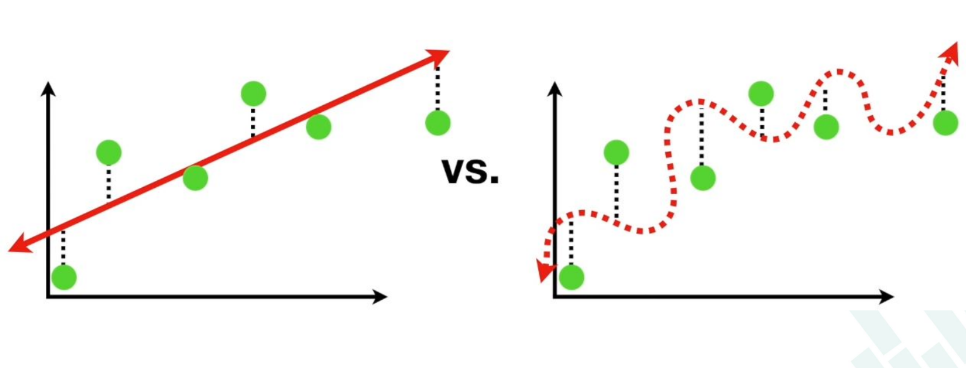

# CSE343: Machine Learning Assignment-1
## Ritika Thakur | 2022408

### Section A: Theoretical 

#### Question 1: You are developing a machine-learning model for a prediction task. As you increase the complexity of your model, for example, by adding more features or by including higher-order polynomial terms in a regression model, what is most likely to occur? Explain in terms of bias and variance with suitable graphs as applicable.
Ans: As we increase the complexity of our model by adding more features or by including higher-order polynomial terms in a regression model, the model will most likely overfit the data. Overfitting occurs when the model learns the training data too well, including the noise in the data, and fails to generalize to new, unseen data. This is because the model is too complex and has too many parameters, which allows it to fit the training data very closely but makes it less likely to generalize to new data. This overfitting will result in:

1. **Lower bias**: The model fits the training data very closely, thus reducing training error loweing the bias.

2. **Higher variance**: The model is too complex and fits the noise in the training data, which makes it less likely to generalize to new data, increasing the variance. Variance refers to the error due to the model's sensitivity to the training data.

#### Question 2: You’re working at a tech company that has developed an advanced email filtering system to ensure users’ inboxes are free from spam while safeguarding legitimate messages. After the model has been trained, you are tasked with evaluating its performance on a validation dataset containing a mix of spam and legitimate emails. The results show that the model successfully identified 200 spam emails. However, 50 spam emails managed to slip through, being incorrectly classified as legitimate. Meanwhile, the system correctly recognised most of the legitimate emails, with 730 reaching the users’ inboxes as intended. Unfortunately, the filter mistakenly flagged 20 legitimate emails as spam, wrongly diverting them to the spam folder. You are asked to assess the model by calculating an average of its overall classification performance across the different categories of emails.

Ans: We will use the below metric to evaluate the model's performance:

1. True Positive (TP): The number of spam emails correctly identified by the model = 200
2. False Negative (FN): The number of spam emails incorrectly classified as legitimate = 50
3. True Negative (TN): The number of legitimate emails correctly identified by the model = 730
4. False Positive (FP): The number of legitimate emails incorrectly classified as spam = 20

**Accuracy** = (TP + TN) / (TP + TN + FP + FN) = (200 + 730) / (200 + 730 + 20 + 50) = 930 / 1000 = 0.93 or 93%

**Precision** = TP / (TP + FP) = 200 / (200 + 20) = 200 / 220 = 0.909090... or 91%

**Recall** = TP / (TP + FN) = 200 / (200 + 50) = 200 / 250 = 0.8 or 80%

**Specificity** = TN / (TN + FP) = 730 / (730 + 20) = 730 / 750 = 0.9733 or 97.33%

**Negative Predictive Value** = TN / (TN + FN) = 730 / (730 + 50) = 730 / 780 = 0.935 or 93.5%

**F1 Score** = 2 * (Precision * Recall) / (Precision + Recall) = 2 * (0.909090... * 0.8) / (0.909090... + 0.8) = 1.454545... / 1.709090... = 0.85 or 85%

From the above calculations, we can see that the model has an accuracy of 93%, a precision of 91%, a recall of 80%, a specificity of 97.33%, a negative predictive value of 93.5%, and an F1 score of 85%.\
These metrics indicate that the model performs well in identifying legitimate emails but has a lower recall for spam emails, meaning that it misses some spam emails.\
The F1 score, which is the harmonic mean of precision and recall, is 85%, indicating that the model has a good balance between precision and recall.

#### Question 3: Consider the following data where y(units) is related to x(units) over a period of time: Find the equation of the regression line and, using the regression equation obtained, predict the value of y when x = 12.

Ans: 

#### Question 4: Given a training dataset with features X and labels Y , let f(X) be the prediction of a model f and L(f(X), Y ) be the loss function. Suppose you have two models, f1 and f2, and the empirical risk for f1 is lower than that for f2. Provide a toy example where model f1 has a lower empirical risk on the training set but may not necessarily generalize better than model f2.

Ans: If f1 has a lower empirical risk than f2 on the training set but does not necessarily generalise on the testing set then we are talking about the case of overfitting. Overfitting occurs when the model learns the training data too well, including the noise in the data, and fails to generalize to new, unseen data. This is because the model is too complex and has too many parameters, which allows it to fit the training data very closely but makes it less likely to generalize to new data.\

Image on left is the model f2: a linear model which shows a higher bias on the training data as compared to the image on the right in which the model f1: a polynomial model which shows a lower bias on the training data.\

Image on left is the model f2: a linear model which shows a lower variance on the testing data as compared to the image on the right in which the model f1: a polynomial model which shows a higher variance on the testing data.

Let us take a toy example to illustrate this scenario:

